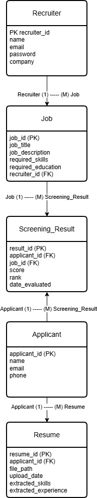

# AI-Based Resume Screening and Ranking System

## Overview
The AI-Based Resume Screening and Ranking System is designed to assist recruiters in evaluating job applicants quickly and efficiently. 

In many organizations, recruiters receive a large number of resumes when a job position is posted. Reviewing these resumes manually can be time-consuming and inefficient. This system aims to automate the initial resume screening process by analyzing resumes and comparing them with job descriptions.

The system scans uploaded resumes, extracts relevant information such as skills and qualifications, and compares them with the required job criteria. It then calculates a matching score and ranks applicants based on how closely their resumes match the job description.

This helps recruiters quickly identify the most suitable candidates.

---

## Project Objectives

### General Objective
To develop a simple AI-based system that can automatically screen resumes and rank applicants based on job requirements.

### Specific Objectives
- Allow recruiters to upload resumes.
- Extract important information from resumes such as skills and qualifications.
- Compare resume content with job descriptions using keyword matching.
- Calculate a matching score for each applicant.
- Rank applicants based on their relevance to the job requirements.

---

## System Features

- Resume Upload and Processing
- Automatic Resume Text Extraction
- Keyword Matching with Job Description
- Applicant Scoring System
- Automated Applicant Ranking

---

## System Workflow

1. Recruiter enters a job description.
2. The system reads uploaded resumes.
3. Resume text is extracted automatically.
4. Keywords are compared with the job description.
5. A similarity score is calculated.
6. Applicants are ranked based on their scores.

## Entity Relationship Diagram (ERD)

The following ERD shows the database structure used for the system.

Entities included in the system:
- Recruiter
- Job
- Applicant
- Resume
- Screening_Result

---

## Technologies Used

- Python
- Pandas
- Scikit-learn
- PDFMiner
- Natural Language Processing (NLP)

---

## Installation

1. Clone the repository

git clone https://github.com/yourusername/ai-resume-screening-system.git

2. Navigate to the project directory

cd ai-resume-screening-system

3. Install the required dependencies

pip install -r requirements.txt

---

## How to Run the System

1. Place resume files in the **resumes/** folder.
2. Run the Python script:

python src/resume_screening.py

3. The system will analyze the resumes and display the ranked applicants.

---

## Example Output

=== Ranked Applicants ===

Applicant Score
john_santos_resume.pdf 0.82
maria_cruz_resume.pdf 0.74
kevin_garcia_resume.pdf 0.63
mark_tan_resume.pdf 0.41
angela_reyes_resume.pdf 0.28

Higher scores indicate a better match with the job description.

---

## Scope and Limitations

### Scope
The system focuses on assisting recruiters in automatically screening resumes and ranking applicants based on keyword matching.

### Limitations
- The system only performs basic keyword matching.
- It does not perform advanced AI decision-making.
- It depends on the presence of relevant keywords in resumes.

---

## Future Improvements

Possible improvements for the system include:

- Web-based interface for recruiters
- Database integration
- Advanced NLP resume analysis
- Machine learning-based candidate scoring
- Support for multiple resume formats

---

## Authors

**Ricus Yeshua M. Alzona**  
**Justin Matthew R. Cruz**

Course: ITS120 – Final Project  
AI-Based Resume Screening and Ranking System

---

## Project Structure
